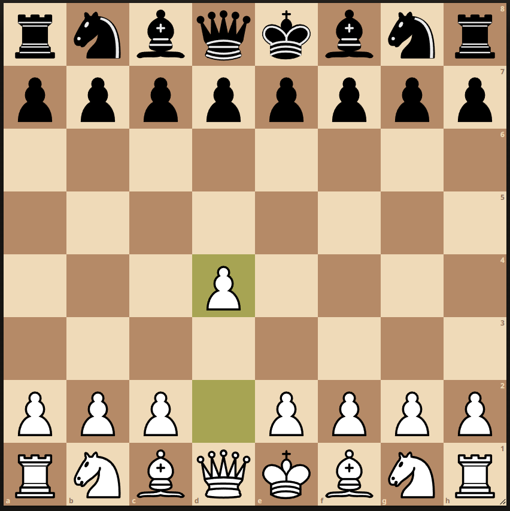

# **Training your own model!**

###### I've finally managed to make this guide.


Model was created using Convolutional Neural Network algorithm. It was trained on 32x32 grayscale chess tiles. Predicts
chessboards layouts from online chessboard screenshots.

* 5x5x32 Input Convolution layer
* 5x5x64 Convolution layer
* 8x8x1024 Dense Fully Connected layer
* 1024x13 Dropout + softmax Readout layer

> The main.py file is the main client for the model. It must be used on the online chessboard, which will return the FEN 
and make chessboard moves for you.
```
python main.py
```


> The fen_generator.py file contains the usage of the model on images and returning the FEN without making chessboard 
moves. To use this file, you must comment line 28 and uncomment line 29. The images to scan should be placed in 
train_data with the name of the picture "checker.png".
```
python training/fen_generator.py
```
## Example usage:
>Input picture:
> 

Let's run fen generator and see what we will get.

```python training/fen_generator.py```

Output we got:
```
--- Prediction on file ./train_data/checker.png ---

Certainty range [0.999987 - 1], Avg: 0.999998
---
Predicted FEN:
rnbqkbnr/pppppppp/8/8/3P4/8/PPP1PPPP/RNBQKBNR w QKqk - 0 1
Final Certainty: 100.0%
Closing session.
```
And here we have the result we were all hoping for! We even got to find out if castling is an option for us.
The accessibility of castling is determined by our first and last line of FEN.

# **Training your model**